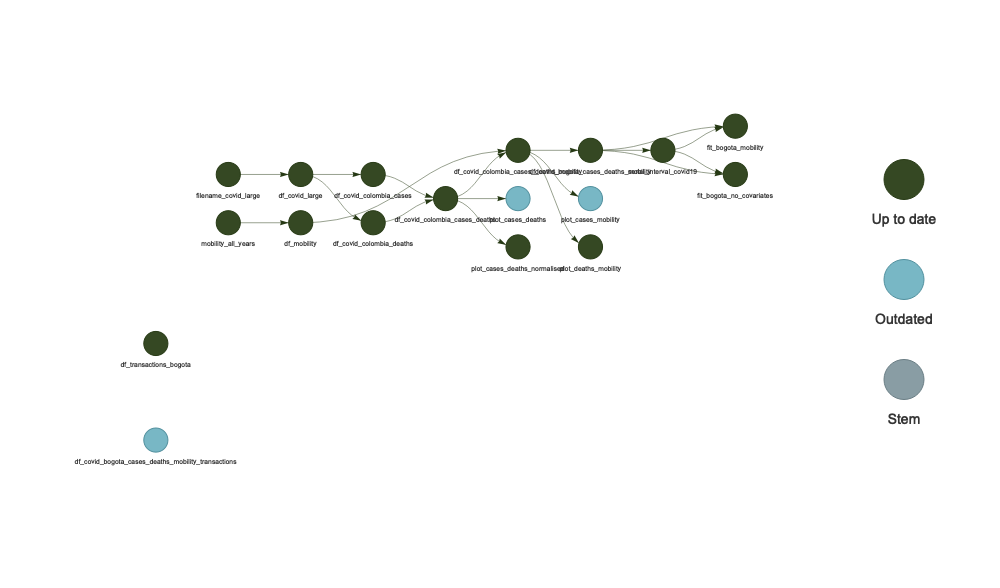

<!-- README.md is generated from README.Rmd. Please edit that file -->

# Materials for Parag & Lambert (2024) paper on epidp

<!-- badges: start -->
<!-- badges: end -->

This repostory uses
[renv](https://rstudio.github.io/renv/articles/renv.html) to ensure that
the environment used by someone wishing to rerun the analysis is the
same as that used to originally run it. First clone the repository, open
up the R project then run:

``` r
renv::restore()
```

We use [targets](https://books.ropensci.org/targets/) to ensure that the
data analysis pipeline is reproducible. To rerun our analyses, run the
following:

``` r
targets::tar_make()
```

Below we visualise the process leading to the outputs of our analysis as
a directed acyclic graph.

``` r
library(targets)
tar_visnetwork(targets_only=TRUE)
#> - The project is out-of-sync -- use `renv::status()` for details.
```

## Example script for producing DP time series
In [this R script](R/create_dp_data.R) we provide code for producing a DP time series from example financial data; note that we cannot provide such financial data since this is itself private.

<!-- -->
